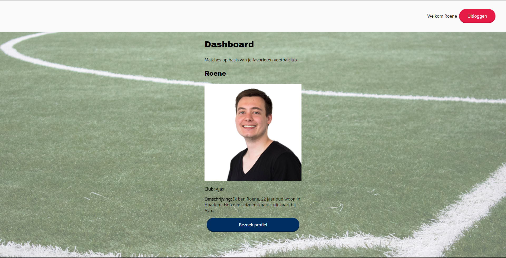
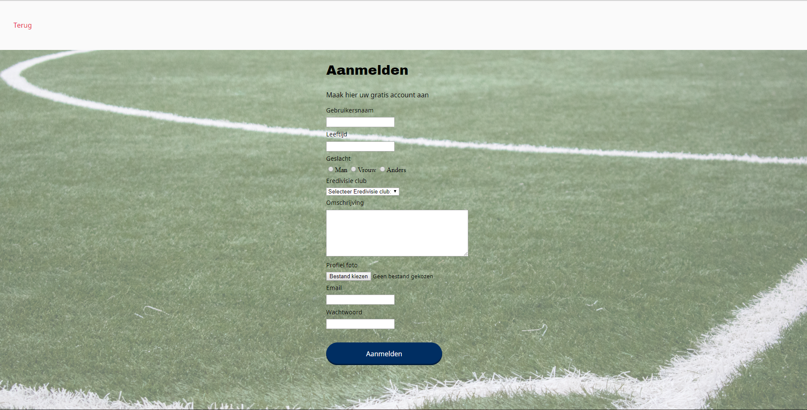

# Be-Assesment 2 | EreDate 
This is a project for my backend assesment 2 and Project Tech. It it is a dynamic website using Git, Express, Node.js and MySQL. This dating app match users with other users who support the same Eredivisie football club.

## Table of Contents
* [To Do](#to-do)
* [Description](#description)
* [Installing](#installing)
* [Sources](#sources)
* [Licence](#licence)

## To Do
This is a list of things in want to do in this project.
- [x] Create an account
- [x] Login / Logout
- [x] View profile(s)
- [x] Delete account
- [ ] Edit own profile information
- [ ] Find matches
- [ ] Send a chat message

## Description
This website is a dating app where users match other users who are supporting the same Eredivisie football club.



### Start
The starting page is the first screen users will see. Here they have the choice to create an account or login to an existing one.

### Sign up
Add the sign up page users can create their own account. They need to fill in the following information:

* Name
* Age
* Gender
* Club
* Description
* Profile Picture
* Email
* Password



## Installing
To install this project enter the following into your _terminal_:
```
git clone https://github.com/Roene/be-assesment-2

cd be-assessment-2-verbeek-roene

npm install
```

Then to start the server enter the following:  
```
npm start
```
### Database
After the installing you have to create a MySQL database.

After you installed MySQL you have to login to your account:
```
mysql -u your-username -p
```

Then run the following SQL to create the database and enter it:
```
CREATE DATABASE IF NOT EXISTS datingapp;

USE datingapp
```

After creating the database run the following SQL to create the users table. This is the place where we will store all users that register a account:
```
CREATE TABLE IF NOT EXISTS users (
  id INT NOT NULL AUTO_INCREMENT,
  username TEXT CHARACTER SET utf8,
  age TEXT CHARACTER SET utf8,
  gender TEXT CHARACTER SET utf8,
  club TEXT CHARACTER SET utf8,
  description TEXT CHARACTER SET utf8,
  picture TEXT CHARACTER SET utf8,
  email TEXT CHARACTER SET utf8,
  hash TEXT CHARACTER SET utf8,
  PRIMARY KEY (id)
);
```

### Packages
This project makes use of the following packages:

* [bcrypt](https://www.npmjs.com/package/bcrypt)
* [body-parser](https://www.npmjs.com/package/body-parser-json)
* [dotenv](https://www.npmjs.com/package/dotenv)
* [ejs](https://www.npmjs.com/package/ejs)
* [express](https://www.npmjs.com/package/express)
* [express-session](https://www.npmjs.com/package/express-sessions)
* [multer](https://www.npmjs.com/package/multer)
* [mysql](https://www.npmjs.com/package/mysql)

## Sources
Used the sources provided by [Titus Wormer](https://github.com/wooorm):
* [plain-server](https://github.com/cmda-be/course-17-18/tree/master/examples/plain-server)
* [express-server](https://github.com/cmda-be/course-17-18/tree/master/examples/express-server)
* [mysql-server](https://github.com/cmda-be/course-17-18/tree/master/examples/mysql-server)
* [Backend Development Lecture 6](https://docs.google.com/presentation/d/1BHMqO9UV5ePt29n8cnjaznvye8Gu_HrdzhzC3h5rgOI/edit#slide=id.g2922825c54_2_58)
* [Backend Development Lab 8](https://docs.google.com/presentation/d/17acFykwNaTmiiPZJElAqBfz-9XlvuRf6KNU2t-Bm5w0/edit#slide=id.g2922825c54_2_58)

## Licence

MIT © [Roene Verbeek](https://github.com/Roene)